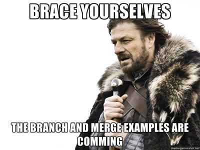
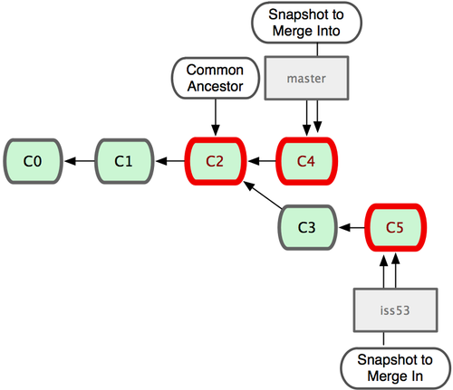
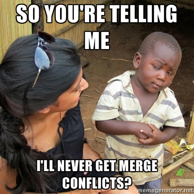
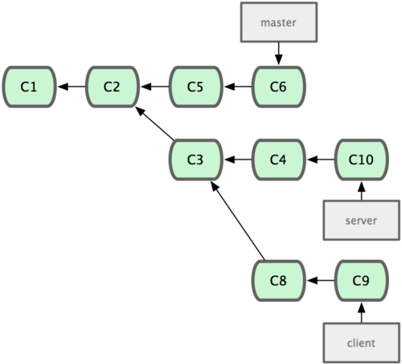
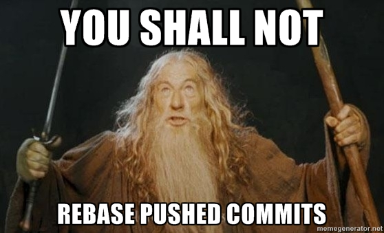

# Hey elgin - Let's git!

---

# About me and VCS
+ Used SVN, TFS and git
+ Fell in love with git - because it changed (for better) my way of working
+ Am by no means a git expert
+ Respect and understand people who use other VCSs

---

## What have I signed up to?
+ What's a VCS and why do I need one?
+ Configuration
+ Using git
+ Branching & Merging
+ Branching Model
+ Tools?

---

# What is git?

--->

# It's a VCS...

--->

# Cool!
### So before we dwelve into git... 

--->

## What is a VCS good for? 
 * Traveling back in time
    + Revert files back to a previous state
    + Revert the entire project back to a previous state
    + Compare changes over time
    + Who introduced an issue and when
 * Sharing
 * Collaborating
 * Paralelizing your work
    + Solving multiple issues separately
    + Make a quick fix in the midst of developing a feature

--->

# Awesome, I want one!
### Is git the only option?
### \*cof\* No... \*cof\*

--->

## Frequently making a backup
* The caveman solution
* Muggles still use this everyday
    + Designers
    + Managers
    + Lawyers
    + Doctors

* Good
    + Pretty straightforward
* Bad
    + ???

--->

## Suddenly... CHAOS!

--->

## Local VCS
* Good
    + ???
* Bad
    + Hard to manage over time
    + Hard to collaborate
    + Single point of failure

--->

## Centralized VCS
* CVS, Subversion, etc.
* Standard solution for many years and still used by many

* Good
    + Easier to collaborate
    + Not too hard to understand
    + Easier to administer (if you're a devop)
* Bad
    + Single point of failure
    + Hard to work without access to the server

--->

## Distributed VCS
* git, Mercurial, etc.
* Clients fully mirror the repository
* No single point of failure
* Best for collaboration - multiple remotes

--->

# So... git!

--->

## git is designed for
* Speed - simple design
* Non-linear development (thousands os parallel branches)
* Fully distributed
* Scale - able to handle large projects like the Linux kernel efficiently

--->

## git is different
* While other VCSs represent commits as file based changes, git takes snapshots of the files
* git stores data as snapshots of the project over time
* Nearly every operation is local
* Local history
* Database is replicated when cloning
* You can commit without network connection
* Integrity is built-in

--->

## O'rly? And who's using it?
* Linux
* Rails
* Google
* Facebook
* Microsoft
* Twitter
* LinkedIn
* ...
* elgin?

--->

# If you don't use git, you better have a good reason not to

---

# Let's git!

---

# Configuration

--->

## Where are my settings?
* System setting       : `/etc/gitconfig`
* Global user settings : `~/.gitconfig`
* Repository settings  : `.git/config`
* Windows: `C:\Documents and Settings\$USER\.gitconfig`

--->

## What should I configure?
##### Identity

    git config --global user.name "John Doe"
    git config --global user.email johndoe@example.com

##### Editor

    git config --global core.editor vim

##### Merge tool - don't change this if you're not sure

    gif config --global merge.tool vimdiff

##### Check current settings

    git config --list # show all config values, last ones have priority
    git config user.name # show config value

--->

## Need help?
    git help <verb>
    git <verb> --help
    man git-<verb>

Example:

    git help config

* IRC - irc.freenode.net
    + \#git
    + \#github
* Free book! - [ProGit](http://git-scm.com/book "ProGit")
* Ask me!

---

# Using git

--->

### Initializing a repository in an existing directory
    git init
 
### Cloning an existing repository
    git clone <repo>

--->

### Possible status of files
+ Untracked - changes are not recorded by git
+ Tracked
    + unmodified - no changes since last snapshot
    + modified - modified since last snapshot
    + staged - a modified snapshot which is ready for commit

--->

--->

## Checking the status of your files
    $ git status
    # On branch master
    nothing to commit (working directory clean)
 
## After creating a new file
    $ touch README
    $ git status
    # On branch master
    # Untracked files:
    #   (use "git add <file>..." to include in what will be committed)
    #
    #   README
    # nothing added to commit but untracked files present (use "git add" to
    # track)

--->

## Adding a file
    $ git add README
 
## Now let's check the status again
    $ git status
    # On branch master
    # Changes to be committed:
    #   (use "git reset HEAD <file>..." to unstage)
    #
    #   new file:   README
    #

--->

## Let's modify an already tracked file
    $ vim index.html (& make some changes)
 
## What's the status now?
    $ git status
    # On branch master
    # Changes to be committed:
    #   (use "git reset HEAD <file>..." to unstage)
    #
    #   new file:   README
    #
    # Changes not staged for commit:
    #   (use "git add <file>..." to update what will be committed)
    #
    #   modified:   index.html
    #

--->

## Very good. How do I stage it?
    $ git add index.html
 
## And the status?
    $ git status
    # On branch master
    # Changes to be committed:
    #   (use "git reset HEAD <file>..." to unstage)
    #
    #   new file:   README
    #   modified:   index.html
    #

--->

## git add is a multipurpose command
+ git add to track new files
+ git add to stage files
+ git add to mark conflicts as resolved

--->

## What changes have I made?
    $ git diff          // changes still unstaged
    $ git diff --cached // changes staged to commit

--->

## I want to commit!
    $ git commit -m "Learning git is fun!"
 
### This will commit everything which is staged

--->

## Robert Baratheon commits

--->

## Robert Baratheon commits
    $ git commit -a -m "fix stuff"
 
### This will stage and commit the files in a single operation

--->

## Regarding commit messages
+ Are in the present tense
+ Start with a capitalized letter
+ Have a subject that does not exceed 50 chars
+ Have a thourough message body that explains in detail what was changed and why. This message is linewrapped at 72 chars.

--->

## "I commited but forgot to..."
    $ git commit --ammend

--->

## Removing files
    $ git rm file.txt          // removes from repo & working directory
    $ git rm --cached file.txt // removes from repo

--->

## Moving  and renaming files
    $ git mv file_from file_to
 
## Is just a short hand for
    $ mv README.txt README
    $ git rm README.txt
    $ git add README

--->

## Ignoring files
    $ EDITOR .gitignore
IDE files, local settings, etc...

--->

## View the commit history
    $ git log

--->

## Removing a file from the staging area
    $ git reset <filename>

--->

## Undo file changes
    $ git checkout <filename>

--->

## Remotes
### List remotes
    $ git remote -v
### Add a remote
    $ git remote add <name> <url>

--->

## Fetch changes from remote
    $ git fetch <remote>
 
## Fetch + Merge with branch
    $ git pull <remote> <branch>
 
## Pushing
    $ git push <origin> <branch>

---

# Branching & Merging

--->

## But before branching...

--->

## How does git stores one commit?

--->

## How does git stores many commits?

--->

## A branch is... just a pointer

## Snapshots FTW!

--->

## Multiple branches = Multiple pointers

--->

## How do I know which branch I'm on?

## HEAD

--->

## How do I know which branch I'm on?

## HEAD

--->

## Catchup
A commit consists of

+ Message
+ Author
+ Commiter
+ Date
+ Pointer to tree (snapshot)
+ Pointer to previous commits

--->

## What are branches?
+ A branch in Git is simply a lightweight movable pointer to one of these commits.
+ When you commit, the branch moves forward, pointing to the new commit.
+ A branch in git is actuality a simple file that contains the 40 character SHA–1 checksum of the commit it points to

--->

## Branching is inexpensive
+ Creating a new branch is just creating another pointer!
+ Creating a new branch is as quick and simple as writing 41 bytes to a file (40 characters and a newline).
+ Branching is a LOCAL operation, no server communication is needed
+ Switching branches changes the files in the working directory
+ A special pointer called HEAD always points to the current branch

--->

--->

### Create a branch
    $ git branch <branch_name>
### Delete a branch
    $ git branch -d <branch_name>
### Move to another branch
    $ git checkout <branch_name>
### Create a branch and switch to it
    $ git checkout -b <branch_name>
### List branches
    $ git branch

--->

# Some examples of branching models

--->

## Topic branches

You should branch everytime you do something new.

Branch for:

+ Fixes
+ Features
+ Experiments

--->

## Long-running branches
 
### If you do not care about versions
+ Keep master stable!

 
### If you want to release specific versions
+ Develop on master
+ Branch to stable release versions
+ Fix bugs on release versions branches and merge onto master
+ Never merge master onto release version branches

--->

--->

## The scenario
+ Do work on a web site
+ Create a branch for a new story you’re working on
+ Do some work in that branch

 

## James calls (angry) for a hotfix
+ Revert back to your production branch
+ Create a branch to add the hotfix
+ After it’s tested, merge the hotfix branch, and push to production
+ Switch back to your original story and continue working

--->

## In the begining...

--->

## Time to start working on issue #53
    $ git checkout -b iss53
    Switched to a new branch "iss53"

--->

## Do some work
    $ vim index.html
    $ git commit -a -m 'added a new footer [issue 53]'

--->

## James calls - Let's get back to master
    $ git checkout master
    Switched to branch "master"

--->

## Fixing the problem
    $ git checkout -b hotfix
    Switched to a new branch "hotfix"
    $ vim index.html
    $ git commit -a -m 'fixed the broken email address'
    [hotfix]: created 3a0874c: "fixed the broken email address"
     1 files changed, 0 insertions(+), 1 deletions(-)

--->

## Ready to production? - Merge to master
    $ git checkout master
    $ git merge hotfix
    Updating f42c576..3a0874c
    Fast forward
     index.html |    1 -
     1 files changed, 0 insertions(+), 1 deletions(-)

--->

## Let's continue working on issue #53
    $ git checkout iss53
    Switched to branch "iss53"
    $ vim index.html
    $ git commit -a -m 'finished the new footer [issue 53]'
    [iss53]: created ad82d7a: "finished the new footer [issue 53]"
     1 files changed, 1 insertions(+), 0 deletions(-)

--->

## Time to merge into master
    $ git checkout master
    $ git merge iss53
    Merge made by recursive.
     index.html |    1 +
     1 files changed, 1 insertions(+), 0 deletions(-)

--->

## The end result

--->

--->

## You are...
    $ git merge iss53
    Auto-merging index.html
    CONFLICT (content): Merge conflict in index.html
    Automatic merge failed; fix conflicts and then commit the result.

 

## Checking the status
    $ git status
    index.html: needs merge
    # On branch master
    # Changes not staged for commit:
    #   (use "git add <file>..." to update what will be committed)
    #   (use "git checkout -- <file>..." to discard changes in working directory)
    #
    #   unmerged:   index.html
    #

--->

## Conflict example
    <<<<<<< HEAD:index.html
    
Awesome!

    =======
    

        Wunderbar!
    

    >>>>>>> my-other-branch:index.html

__Remember:__ `HEAD` is was what you had checked out when you ran your merge command

--->

## Mark file as resolved
    $ git add <filename>
 
## Graphical tool to solve the issues
    $ git mergetool
 
## Continue merge after solving conflicts
    $ git commit

--->

## Rebasing

Reapplying a diverging branch onto another

    git checkout <diverging_branch>
    git rebase master

After rebasing, a merge of master with diverging_branch will fast-forward master

--->

## How rebase works
1. Finds the common ancestor of the two branches (base)
2. Gets the diff of each commit of the branch you’re on, from the base
3. Saves those diffs to temporary files
4. Resets the current branch to the same commit as the branch you are rebasing onto
5. Applies each change (diff) in turn

--->

## Care to give an example?

--->

## Merge

--->

## Rebase - Step #1
    $ git checkout experiment
    $ git rebase master
    First, rewinding head to replay your work on top of it...
    Applying: added staged command

--->

## Rebase - Step #2
    $ git checkout master
    $ git merge experiment

--->

## A more interesting rebase

--->

## Integrate the client changes to master

--->

## Rebasing fundamentals

> Rebasing replays changes from one line
> of work onto another in the order they
> were introduced, whereas merging takes 
> the endpoints and merges them together.

__The only difference between merging and rebasing is the resulting history__

--->

--->

## Tips
+ Don't be afraid to branch and merge frequently
+ At the begining, ad if you're working on the same branch: ignore rebase

## Like this
    $ git commit -m "Fancy message" // Many of these
    $ git pull origin develop       // This merges. Simpler
    $ git push origin develop       // Push commits

---

# Branching model

--->

## A branching model allows you to...

+ Release your code more frequently
+ Keep a production ready state of your product
+ Don't wait for nobody to push that hotfix
+ Better collaborate on features

--->

## A successful/common model

---

# Tools?

---

# For the future

+ Stashing
+ Cherry-pick
+ Interactive staging
+ Interactive rebasing

---

# Conclusions

--->

## Not so good things

+ It's different
+ It will take some time to get the handle
+ You wont spend 2 hours doing merges anymore :-)

--->

## Good things

+ You shouldn't use git (or other VCS) to just 'save your work' at the end of the day
+ Craft your commits - it will help you
+ Treating commits as snapshots brings advantages
+ Branch and Merge are friends - __don't be afraid of them!__

--->

